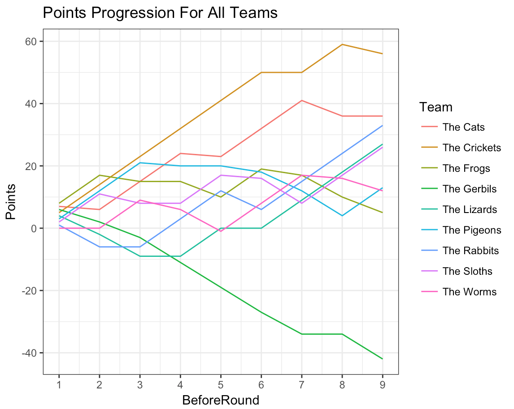
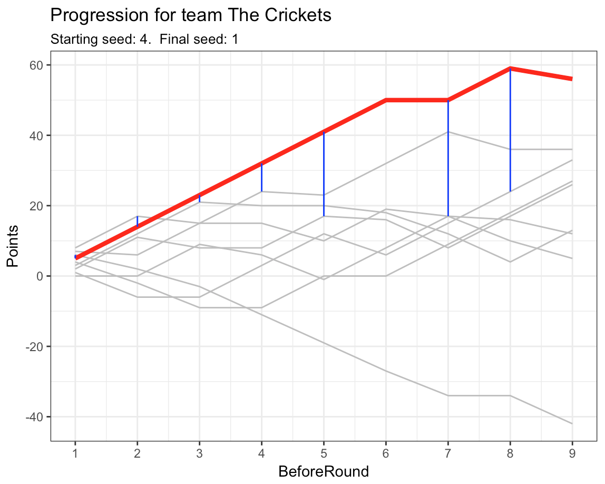

# FairPlay
The inspiration for this project came from a beach volleyball league.  My team went undefeated during the regular season, but this was mostly due to poor matchups. There were at least three teams better than my own who we never played during the regular season!  FairPlay is a framework for scheduling matchups that attempts to solve this problem.  Notable features of the framework are:

- Assumes two or more teams per league
- Teams play head-to-head for each of N rounds of play
- Teams gains or loses points after each game
- Points are used to determine fair matchups
- Can prevent two teams from playing each other twice within K rounds of play

## Example
Here we simulate a league with 9 teams and 8 weeks of play. Each team must be seeded to begin the season.

teams
```
|     Team     |  StartingSeed  |  StartingPoints  |
|:------------:|:--------------:|:----------------:|
|  The Frogs   |       1        |        8         |
|   The Cats   |       2        |        7         |
| The Gerbils  |       3        |        6         |
| The Crickets |       4        |        5         |
| The Lizards  |       5        |        4         |
| The Pigeons  |       6        |        3         |
|  The Sloths  |       7        |        2         |
| The Rabbits  |       8        |        1         |
|  The Worms   |       9        |        0         |
```

Round1 Matchups
```
|  Round  |    Team1    |    Team2     |  Team1Win  |
|:-------:|:-----------:|:------------:|:----------:|
|    1    |  The Frogs  |   The Cats   |    TRUE    |
|    1    | The Gerbils | The Crickets |   FALSE    |
|    1    | The Lizards | The Pigeons  |   FALSE    |
|    1    | The Sloths  | The Rabbits  |    TRUE    |
```

Teams who win gain 9 points.  Teams who lose, lose points equal to the seed of the team they played.  For example, since The Cats lost to The Frogs (the 1 seed), The Cats lose 1 point, bringing their total to 6 - 1 = 5 points before starting Round 2.

Resulting Points
```
|     Team     |  StartingSeed  |  BeforeRd2Seed  |  BeforeRd2Points  |
|:------------:|:--------------:|:---------------:|:-----------------:|
|  The Frogs   |       1        |        1        |        17         |
|   The Cats   |       2        |        5        |         6         |
| The Gerbils  |       3        |        6        |         2         |
| The Crickets |       4        |        2        |        14         |
| The Lizards  |       5        |        8        |        -2         |
| The Pigeons  |       6        |        3        |        12         |
|  The Sloths  |       7        |        4        |        11         |
| The Rabbits  |       8        |        9        |        -6         |
|  The Worms   |       9        |        7        |         0         |
```

Here's a simulation of how each team's total points change from start to finish.


And if we single-out one team, for example, The Crickets:

Here the blue lines connect The Crickets to the team it played against at each round.  Notice how, as The Crickets dominated, they did not play any of the worst performing teams near the bottom.  (Also take note of their bye-weak during week 6).

We can inspect the actual games played by The Crickets
```
|  Round  |     Team     |  Opponent   |  Won  |  StartingPoints  |  OppSeed  |  PointsGained  |  CmltvPoints  |
|:-------:|:------------:|:-----------:|:-----:|:----------------:|:---------:|:--------------:|:-------------:|
|    1    | The Crickets | The Gerbils | TRUE  |        5         |     3     |       9        |      14       |
|    2    | The Crickets |  The Frogs  | TRUE  |        14        |     1     |       9        |      23       |
|    3    | The Crickets | The Pigeons | TRUE  |        23        |     2     |       9        |      32       |
|    4    | The Crickets |  The Cats   | TRUE  |        32        |     2     |       9        |      41       |
|    5    | The Crickets | The Sloths  | TRUE  |        41        |     4     |       9        |      50       |
|    7    | The Crickets |  The Worms  | TRUE  |        50        |     4     |       9        |      59       |
|    8    | The Crickets | The Rabbits | FALSE |        59        |     3     |       -3       |      56       |
```

Notice how The Crickets never played the same team twice within a short timespan (or in this case, never at all).  FairPlay is deisnged so that we can forcefully prevent teams from playing each other twice within a short timespan while still generating competitive matchups between teams.
